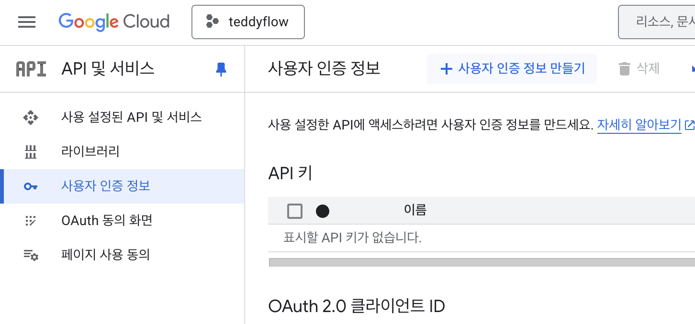
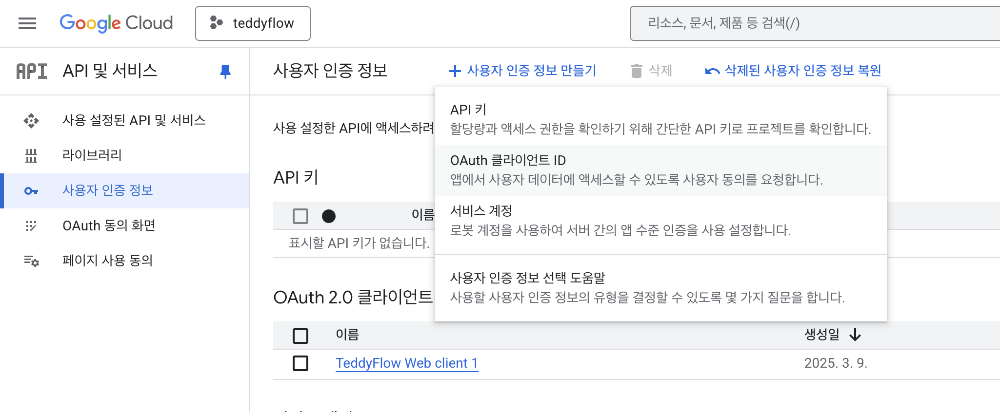
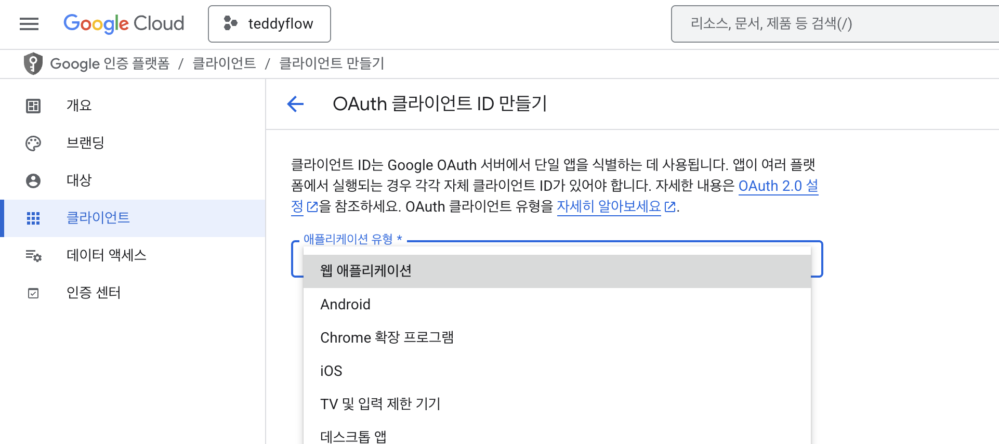
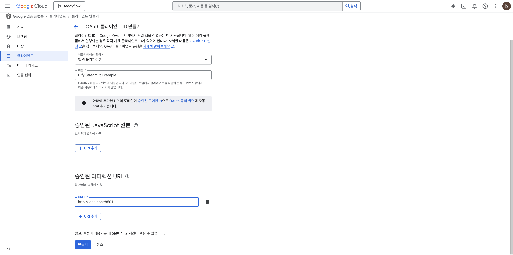
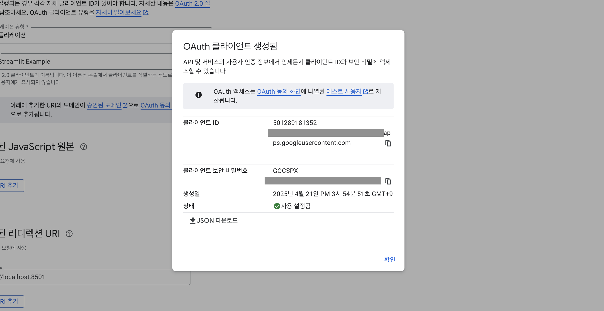

# Dify Streamlit 사용 예제

이 프로젝트는 Dify의 API를 Streamlit과 통합하여 대화형 AI 애플리케이션을 만드는 방법을 보여줍니다.

## 주요 기능

- Streamlit 기반 사용자 인터페이스
- Dify 의 [챗봇, 에이전트, 채팅플로우] 앱 지원
- 멀티턴 대화, 사용자 별 대화 목록 관리
- 파일 업로드, 이미지 생성 지원
- YAML을 통한 앱 제목, 로고 이미지 설정
- Google 로그인 지원

## 설치 방법

1. 저장소 복제:

```bash
git clone [저장소-URL]
cd dify-streamlit-usecase
```

2. 가상 환경 생성 및 의존성 설치:

```bash
uv sync
```

[uv 가 설치되지 않은 경우, 설치 방법](https://docs.astral.sh/uv/getting-started/installation/#standalone-installer)

## 설정

1. 예제 설정 파일 복사:

```bash
cp config.example.yaml config.yaml
```

2. `config.yaml` 파일을 다음 설정으로 편집:

- Dify API 키
- 기타 애플리케이션 설정
- Google OAuth 인증 정보

## 사용 방법

1. Streamlit 애플리케이션 시작:

```bash
uv run streamlit run main.py
```

2. 브라우저를 열고 제공된 로컬 URL로 이동 (일반적으로 http://localhost:8501)

## 프로젝트 구조

- `main.py`: 메인 Streamlit 애플리케이션
- `sdk.py`: Dify API Client SDK
- `config.yaml`: 애플리케이션 설정
- `pyproject.toml`: 프로젝트 의존성

## Google 인증 설정

1. [Google Cloud Console](https://console.developers.google.com)로 이동
2. 좌측의 사용자 인증 정보 클릭
   
3. 사용자 인증 정보 만들기 > OAuth 클라이언트 ID
   
4. 웹 애플리케이션 선택
   
5. 승인된 리디렉션 URI 추가 (http://localhost:8501)
   
6. `config.yaml`의 설정을 인증 정보로 업데이트
   

## 라이선스

[MIT 라이선스](LICENSE)

## 기여하기

기여를 환영합니다! Pull Request를 자유롭게 제출해 주세요.

## 문의

질문이나 지원이 필요하시면 Issue 를 남겨주세요.

## 작성자

[Neulhan](https://github.com/Neulhan)
